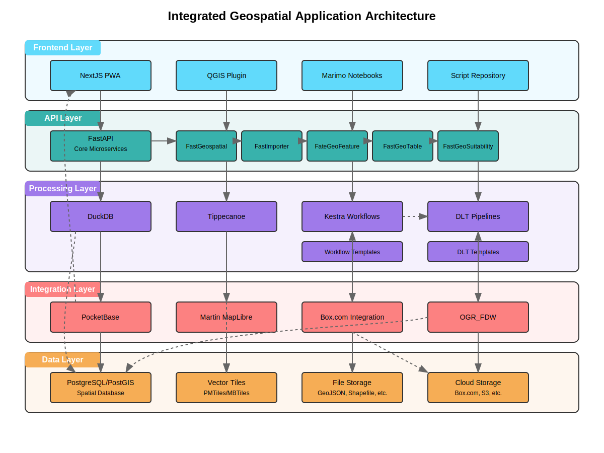
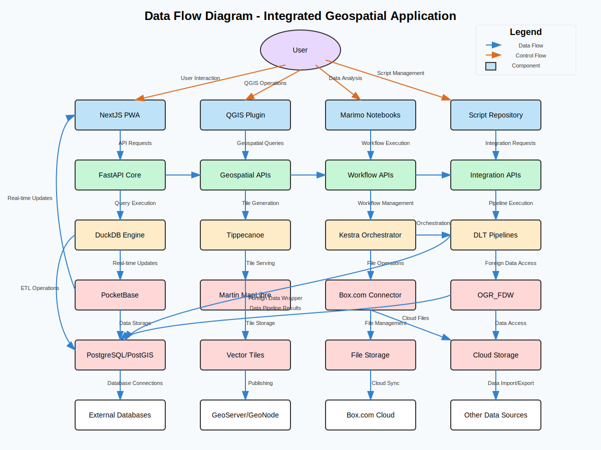
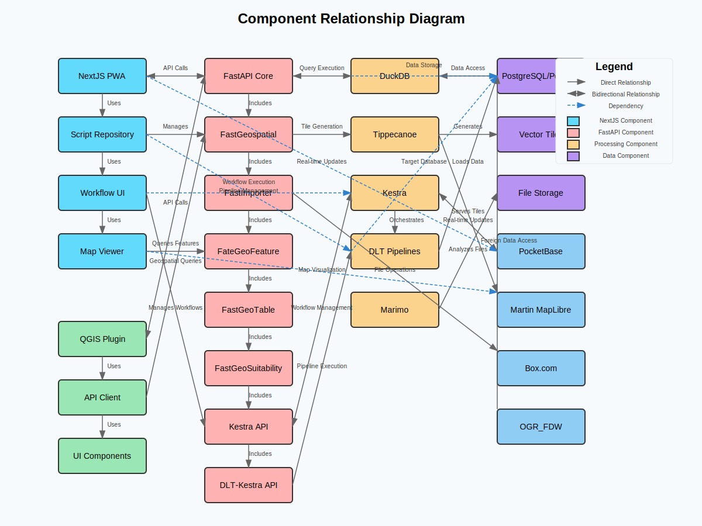

# Architecture Documentation

This document provides an overview of the architecture for the Integrated Geospatial Application, which combines FastAPI microservices, NextJS frontend, QGIS plugin, and various data processing components.

## Architecture Overview

The application is structured in multiple layers, each with specific responsibilities:

1. **Frontend Layer**: User interfaces for interacting with the system
2. **API Layer**: FastAPI microservices that provide endpoints for various operations
3. **Processing Layer**: Components that handle data processing, transformation, and workflow orchestration
4. **Integration Layer**: Components that integrate with external systems and services
5. **Data Layer**: Storage systems for various types of data

## Architecture Diagrams

### System Architecture

This diagram shows the high-level architecture of the system, including all major components and their relationships. The components are organized in layers, with data flowing between them.

### Data Flow Diagram

This diagram illustrates how data flows through the system, from user interaction to storage and back. It shows both control flow (user actions) and data flow (information transfer).

### Component Relationship Diagram

This diagram shows the relationships between individual components, including dependencies, direct relationships, and bidirectional interactions.

## Key Components

### Frontend Components

- **NextJS PWA**: Progressive Web Application built with NextJS that provides the main user interface
- **QGIS Plugin**: Plugin for QGIS that integrates with the backend services
- **Marimo Notebooks**: Interactive notebooks for data analysis and visualization
- **Script Repository**: Repository of scripts for data processing and analysis

### API Components

- **FastAPI Core**: Core FastAPI application that provides the main API endpoints
- **FastGeospatial**: Microservice for geospatial operations
- **FastImporter**: Microservice for importing data
- **FateGeoFeature**: Microservice for managing geo-features
- **FastGeoTable**: Microservice for table-related operations
- **FastGeoSuitability**: Microservice for geospatial suitability analysis
- **Kestra API**: API for interacting with Kestra workflow orchestration
- **DLT-Kestra API**: API for integrating DLT pipelines with Kestra

### Processing Components

- **DuckDB**: In-memory analytical database for fast data processing
- **Tippecanoe**: Tool for generating vector tiles from geospatial data
- **Kestra**: Workflow orchestration platform
- **DLT Pipelines**: Data loading tool for building data pipelines

### Integration Components

- **PocketBase**: Backend for real-time updates and authentication
- **Martin MapLibre**: Server for vector tiles
- **Box.com Integration**: Integration with Box.com for file storage and retrieval
- **OGR_FDW**: Foreign Data Wrapper for accessing external geospatial data

### Data Components

- **PostgreSQL/PostGIS**: Spatial database for storing geospatial data
- **Vector Tiles**: Storage for vector tiles (PMTiles, MBTiles)
- **File Storage**: Storage for various file formats (GeoJSON, Shapefile, etc.)
- **Cloud Storage**: Integration with cloud storage services

## Data Flow

1. **User Interaction**: Users interact with the system through the NextJS PWA, QGIS Plugin, or Marimo Notebooks
2. **API Requests**: Frontend components make requests to the FastAPI microservices
3. **Data Processing**: API services use processing components to handle data
4. **Data Storage**: Processed data is stored in the appropriate storage system
5. **Integration**: External systems are integrated through dedicated components
6. **Real-time Updates**: PocketBase provides real-time updates to frontend components

## Key Workflows

### Geospatial Data Management

1. User uploads geospatial data through the NextJS PWA or QGIS Plugin
2. FastImporter processes the data and stores it in PostgreSQL/PostGIS
3. User can query and visualize the data through the Map Viewer

### Vector Tile Generation

1. User selects geospatial data to convert to vector tiles
2. Tippecanoe generates vector tiles from the data
3. Martin MapLibre serves the vector tiles for visualization

### Data Pipeline Orchestration

1. User creates a data pipeline using the Script Repository
2. DLT-Kestra API creates a workflow in Kestra
3. Kestra orchestrates the execution of the DLT pipeline
4. Results are stored in the appropriate data storage

### Database Monitoring

1. User configures database monitoring in the NextJS PWA or QGIS Plugin
2. Cloud SQL Monitor API collects metrics from the database
3. Metrics are displayed in real-time through PocketBase

## Deployment Considerations

- The application can be deployed as a set of containerized microservices
- Each component can be scaled independently based on load
- Data storage can be configured to use cloud or on-premises solutions
- Authentication is handled through PocketBase with Google SSO integration

## Future Extensions

The architecture is designed to be extensible, allowing for:

- Addition of new data sources through OGR_FDW
- Integration with additional cloud storage providers
- Support for new geospatial data formats
- Enhanced workflow orchestration capabilities
- Integration with additional visualization tools
